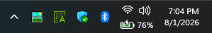
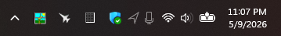
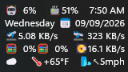
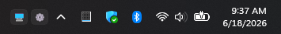

# Sb4ssman's Windhawk Mod Lab

Personal Windows tweaks, built with [Windhawk](https://windhawk.net/).
Most explore making better use of the space available in the taskbar and system
tray; others are small conveniences I've always wanted Windows to have.

Thanks to [@m417z](https://github.com/m417z) and Windhawk for making these mods
possible, and for the maintainer review that helps bring them to the catalogue.

All seven mods below are available in the Windhawk catalogue. Install the
published releases through Windhawk; each mod's documentation covers its settings,
requirements, and additional examples.

[Mods](#mods) · [Repository layout](#repository-layout) · [Screenshots](#screenshots) ·
[Local experiments](#local-experiments)

## Mods

| Mod | Release | Purpose |
|--------|--------|-------------|
| [OmniButton Customizer](omnibutton-customizer/) | [2.1 · Install](https://windhawk.net/mods/omnibutton-customizer) | Arrange network, volume, battery, and percentage with nested layouts and per-item styling. |
| [Privacy Indicator Anchor](privacy-indicator-anchor/) | [2.1 · Install](https://windhawk.net/mods/privacy-indicator-anchor) | Keep location, microphone, camera, and Copilot indicators in stable positions in the tray or beside Start. |
| [Taskbar Clock Spacer](taskbar-clock-spacer/) | [1.1 · Install](https://windhawk.net/mods/taskbar-clock-spacer) | Add elastic spacing to Taskbar Clock Customization format strings. |
| [Taskbar Folder Menus](taskbar-folder-menus/) | [2.1 · Install](https://windhawk.net/mods/taskbar-folder-menus) | Put folder and Shell-menu buttons on the taskbar, with native icons and configurable arrangements. |
| [Task Manager Tail](taskmanager-tail/) | [1.1 · Install](https://windhawk.net/mods/task-manager-tail) | Keep Task Manager at the end of the app buttons on Windows 10 and 11. |
| [Taskbar Virtual Desktop Switcher](taskbar-vd-switcher/) | [2.1 · Install](https://windhawk.net/mods/taskbar-vd-switcher) | Switch desktops from taskbar buttons, with nested layouts and hover previews. |
| [Tray Utility Customizer](tray-utility-customizer/) | [2.1 · Install](https://windhawk.net/mods/tray-utility-customizer) | Arrange the hidden-icons button, Emoji, touch keyboard, pen, and touchpad utilities individually. |

## Repository layout

```text
Windhawk-Mod-Lab/
  omnibutton-customizer/
  privacy-indicator-anchor/
  system-tray-grid-lines/
  taskbar-clock-spacer/
  taskbar-folder-menus/
  taskmanager-tail/
  taskbar-vd-switcher/
  tray-utility-customizer/
  experiments/      independent local prototypes
  tool-mods/         Windhawk mods that are tools for mod authors, not end users
  .agents/           agent instructions, notes, tools, and generated outputs
  _archive/          old retired folders or moved work
  _profiles/         local Windhawk profile snapshots
  _research/         shared investigations and design notes
  _templates/        shared code templates and submission checklists
```

Each mod folder contains its source, user documentation, and available screenshots.

## Screenshots

Simple examples of each mod's main purpose. The surrounding taskbar may also
contain other customizations; each caption identifies the feature being shown.
Click an image for the mod's documentation and additional examples.

### OmniButton Customizer

[](omnibutton-customizer/)

Network and volume above battery and percentage, on a single-height taskbar.

### Privacy Indicator Anchor

[](privacy-indicator-anchor/)

Location and microphone placeholders remain visible when neither is in use.

### Taskbar Clock Spacer

[](taskbar-clock-spacer/)

Elastic spacers align the columns in this custom clock. Taskbar Clock
Customization supplies the content; this companion mod supplies the spacing.

### Taskbar Folder Menus

[](taskbar-folder-menus/)

Two simple buttons: Desktop and Control Panel.

### Task Manager Tail

Keeps Task Manager after the other app buttons. A standalone screenshot is still
to be added; see the [documentation](taskmanager-tail/) for behavior and Windows
10 compatibility details.

### Taskbar Virtual Desktop Switcher

[](taskbar-vd-switcher/)

Two desktop buttons, with the current desktop highlighted.

### Tray Utility Customizer

[](tray-utility-customizer/)

Hidden-icons, Emoji, and touch-keyboard controls in one straightforward row.

## Local experiments

These are separate from the published releases.

| Project | Current scope |
|---|---|
| [Confirmation lights](experiments/confirmation-lights/) | Configurable status lights and a DCG health checker, using diagnostics or user-provided evidence. |
| [Icon hosting](experiments/icon-hosting/) | OmniButton and Quick Settings anchor inspection, with an external icon-overlay prototype. Native injection remains exploratory. |
| [Stats dashboard](experiments/stats-dashboard/) | A customizable retro instrument panel with square and rectangular widgets and simulated readings. |
| [System tray grid lines](system-tray-grid-lines/) | An early concept for visual dividers between tray sections. |

Privacy Indicator Anchor also has an **untested local candidate** adding optional
Recall and OneDrive process/policy indicators. Those additions are not part of
the published 2.1 release.

## Tools for mod authors

| Tool | Status | Purpose |
|---|---|---|
| [Taskbar Tree Dump](tool-mods/mod-tool-taskbar-tree-dump.wh.cpp) | v1.0, PR #5977; paused | Read-only Windows 11 taskbar XAML inspection, with text and JSON output. |
