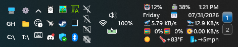

# OmniButton Customizer

A [Windhawk](https://windhawk.net) mod for Windows 11 that takes the native
OmniButton — the network / volume / battery cluster that opens Quick Settings —
and lets you arrange its items into any shape you like, hide the ones you don't
want, and restyle each one independently.


*The four native items as a compact 2×2 block on a single-height taskbar.*


*A tight three-item stack with the percentage hidden and small per-item offsets
applied.*


*Network and volume above battery and percentage, with small per-item offsets
applied inside the arrangement expression.*


*The same items in a single row, reversed: percentage, battery, volume, network.*


*A 2×2 block on a double-height taskbar, beside a wrapped clock.*


*Three items with the battery percentage turned off.*


*Working alongside several other tray and taskbar mods in a dense two-row tray.*


*The percentage enlarged with `Surface` → `Battery percentage size`, the one
font control the mod offers — because the percentage is the one item that is
really a single piece of text.*


*A diamond — `network | (volume, battery) | percent`. Volume on top, battery
below, network and the percentage on the sides. Nesting one stacked pair between
two single items is all it takes.*

## Features

- Arrange network, volume, battery, and the battery percentage into any grid —
  automatically fitted to your taskbar height, or written out by hand
- Turn any of the four items off individually
- Writes no Windows settings and no registry values — it arranges the taskbar
  and nothing else
- Independent color and opacity per item, plus size and font family on the
  battery percentage, the one item that is really a single piece of text
- Per-item and per-group pixel nudges inside the arrangement expression
- Group padding and offset for positioning the cluster inside the button
- Keeps the native button in its native tray position, so other mods' "before
  OmniButton" anchors still mean what they always did
- No XAML Diagnostics, so it coexists with Windows 11 Taskbar Styler

## Why this starts at 2.0

Version 1.0 was never published — it existed only as a pull request. The 2.0 in
the version field marks the settings contract, not a history of releases: every
mod in this family moved to the same grouped layout — Placement, Content,
Layout, Size, Adjust, Surface — and to the shared **Arrangement** expression
that replaced each mod's homegrown grid settings. This mod arrived at that
contract second, so its first published version is the one that has it.

**If you installed 1.x by hand from the pull request**, Windhawk cannot carry
values across renamed keys, so your previous customizations are not migrated —
re-apply them once.

`itemOrder` and the whole grid-mode family are gone, replaced by a single
**Arrangement** field. Grid mode, smart layout, fixed rows and columns, slot
width and height, the coupled/independent battery mode, and all eight per-item
nudge settings no longer exist; what replaced each of them is below.

Battery and percentage are now always two independent arrangement items. The
old coupled mode is not a mode any more — write them next to each other in the
arrangement and you have it, with the freedom to put them anywhere instead.

## The Arrangement field

`Layout` → `Arrangement` decides how the items are placed, and it is the only
field that does. Its default value is the word `auto`:

- **`auto`** fits the available items to the taskbar height. `Fill order`
  chooses whether they fill across rows or down columns; `Short row or column`
  aligns a ragged last group. The shape is worked out for you: the mod takes
  the narrowest grid that fits the height, preferring the one that wastes the
  fewest slots — four items on a standard taskbar become a 2×2 block, not a
  lopsided 3+1.
- **Anything else** is an arrangement you write. Names sit side by side with
  `|` and stack with `,`, and parentheses group them:

  ```text
  network, battery | volume, percent     a 2x2 block
  network | volume | battery | percent   a single row
  network, volume, battery, percent      a single column
  network | volume | (battery, percent)  battery stacked over its percentage
  network | (volume, battery) | percent  a diamond
  ```

  The tokens are `network`, `volume`, `battery`, and `percent`, and they are
  case-insensitive. `network` is the one native slot whose glyph changes
  between Wi-Fi, Ethernet, disconnected, airplane-mode, and VPN states. A
  separator is always required — `network (volume | battery)` is an error,
  not a shorthand for `network | (volume | battery)`.

**Omitting a token hides that item**, exactly like turning it off in `Content`.
Items Windows isn't showing at all — the battery on a desktop PC, for one — are
skipped silently whether you name them or not.

Every time the layout is applied, the arrangement `auto` produced is written to
the Windhawk log. Copy that line into the Arrangement field and you have the
automatic layout as a starting point to edit — the automatic and manual paths
are the same field and the same syntax. If what you write doesn't parse, the
log says what was expected and where, and the automatic arrangement is used
until you fix it.

**Nudging.** Append a pixel offset to any name to move just that item:

```text
network[+2,-1] | volume | battery   network moves 2px right and 1px up
(battery, percent)[3,0] | network   the stacked pair moves 3px right
```

Offsets are cosmetic. Nothing else shifts, and the group's overall size does
not change. To move the whole cluster instead, use `Adjust` → horizontal and
vertical offset. These replace the eight per-item nudge settings that 1.x had.

**The percentage arriving late.** An arrangement you write names the items that
existed when you wrote it. Turn the battery percentage on afterwards and it is
in no group, so by default it is appended after your arrangement rather than
vanishing — the log says when that happened, so you can fold it in when you
next edit. Set `Layout` → `Items your arrangement does not name` to *Leave it
out* if you would rather your arrangement be the whole truth. `auto` always
includes every enabled item.

## The battery percentage

**Whether the percentage exists is Windows' decision, not this mod's.** Turn it
on or off in **Settings → System → Power & battery → Battery percentage**. This
mod does not write that setting, or any other Windows setting.

`Content` → `Battery percentage` hides the percentage from the arrangement,
exactly like the three toggles above it hide their own items. All four mean the
same thing, and none of them reaches outside the taskbar. If Windows isn't
showing the percentage, there is nothing here to arrange or hide and the toggle
does nothing.

*An earlier version did drive the Windows setting. It was removed: even with
the correct registry value and a change broadcast, Explorer only sometimes
re-read it and the Settings page never refreshed, so the control worked once
and then appeared dead. A switch that behaves that way is worse than no switch.*

Because the percentage genuinely appears and disappears in the native tree,
the mod watches for it and re-applies the arrangement when it shows up or goes
away, rather than leaving a briefly unstyled percentage sitting in the cluster.

**It is text, so it does not use `Item width`.** "9%", "80%", and "100%" are
three different widths, and a font change moves them again. The percentage's
cell is measured from the text it actually contains — never narrower than
`Item width`, wider when it needs to be — so it cannot be clipped at the edge
of the group. If the value grows past the cell that was reserved for it, the
layout is re-applied at the new width. Every other item is a glyph and does
use `Item width`.

## Settings

### Placement

| Setting | Default | Description |
|---------|---------|-------------|
| Placement: not available in this mod | — | A note, not a control. The OmniButton stays in its native tray position; editing the box does nothing |

### Content

| Setting | Default | Description |
|---------|---------|-------------|
| Network | On | Wi-Fi, Ethernet, disconnected, airplane-mode, and VPN states share this one native slot |
| Volume | On | |
| Battery | On | Absent on machines without a battery |
| Battery percentage | On | Hides it from the arrangement. Windows decides whether it exists — Settings → System → Power & battery |

### Layout

| Setting | Default | Description |
|---------|---------|-------------|
| Arrangement | `auto` | `auto`, or an arrangement you write — see above |
| Fill order | Fill rows first | Used by `auto` |
| Short row or column | Center | Used by `auto`; start, center, or end |
| Items your arrangement does not name | Add it after | Or leave it out; only applies to a written arrangement |

### Size

| Setting | Default | Description |
|---------|---------|-------------|
| Item width | 0 (fit) | 0 reserves exactly the width each item needs; a number puts every item in a fixed box of that width. Clamped to 0–80 |
| Item height | 24 px | Clamped to 16–80 |
| Item spacing | 0 px | Gap between items along each axis; negative pulls them together. Clamped to −16–40 |

**How to make the cluster tight.** Two settings change the space *between* the
icons, and horizontal padding is not one of them:

- **`Item width`** is the box each glyph is centered in. A native tray glyph is
  about 16px wide, so a 32px box is 16px of dead space per item — barely
  noticeable in a 2×2 block, and half the button in a single row. `0` sizes
  every item to its own content, which is why it is the default.
- **`Item spacing`** is the gap between those boxes, and it goes negative if you
  want them closer than touching.
- **`Horizontal padding`** is *outside* the whole group. It cannot change the
  distance between two items, and no value of it ever will.

If the button looks far bigger than the icons in it, `Item width` is almost
always the reason.

### Adjust

| Setting | Default | Description |
|---------|---------|-------------|
| Horizontal padding | 4 px | Reserved on both sides of the group; clamped to 0–24. **Not cosmetic — see below** |
| Vertical padding | 0 px | Reserved above and below the group; clamped to 0–24 |
| Horizontal offset | 0 px | Moves the group; reserves no space; clamped to ±40 |
| Vertical offset | 0 px | Moves the group up (negative) or down (positive); clamped to ±40 |

**Why horizontal padding defaults to 4 and not 0.** The mod zeroes the
OmniButton's own padding so the arrangement owns the entire content area — and
the button has rounded corners. An item arranged flush against that edge has
its last pixels shaved by the curve, which is exactly what used to clip the
"%" off the battery percentage. Those few pixels are the group's breathing
room, not decoration. Setting it to 0 is supported, but expect edge items to
touch the button's rounded border.

It is *outer* padding: it reserves space at the two ends of the group and can
never change the gap between two items. `Item width` and `Item spacing` do
that.

### Surface

| Setting | Default | Description |
|---------|---------|-------------|
| Network / Volume / Battery / Battery percentage color | *(native)* | Empty preserves the native color |
| Network / Volume / Battery / Battery percentage opacity | -1 | -1 is the native opacity; otherwise 0–100% |
| Battery percentage size | 0 pt | 0 is the native size; clamped to 0–64 |
| Battery percentage font family | *(native)* | Empty preserves the native font |

**Why only the percentage has a size and a font.** Because only the percentage
is a single piece of text. Each of the other three is a **stack of glyphs
layered exactly on top of one another** — network and volume are three deep
(Windows calls them Underlay, Base, and AccentOverlay), the battery is two, an
outline and a fill. That stacking is how one icon shows signal strength, a mute
slash, or a charge level.

Resize or re-font one layer of a stack and it stops coinciding with the others:
you get a larger glyph ghosting over the original rather than a bigger icon. So
those two controls are not offered for items that are stacked, and the mod
works out which is which by counting the glyphs rather than assuming.

Color and opacity work on all four. Color is applied where every layer inherits
it, so a stack recolors as one — except the battery, whose layers have no
shared parent to write to; there the outline recolors reliably and the fill only
on some Windows builds. The log says what it found. Opacity applies to the whole
item rather than to any glyph inside it, so it is always safe.

All color settings accept `#RRGGBB` or `#AARRGGBB` hex (the alpha byte is
honored), the generics `accent`, `accentLight`, and `accentDark` for the
Windows accent shades, or `transparent` for a fully transparent glyph — nothing
drawn, the item still present and clickable. Leaving a color empty keeps the
native color.

## Other taskbar mods

The mod deliberately does not move the native `ControlCenterButton` across tray
columns. Keeping it where Windows put it is what lets other mods' semantic
anchors — "before OmniButton", "before clock" — keep their established meaning.
Moving it would need a shared placement lease so two mods couldn't claim
contradictory anchor order, which is why the Placement group is a note rather
than a control.

## Other taskbar positions

**[Taskbar on top](https://windhawk.net/mods/taskbar-on-top) — supported.**
Everything here is positioned relative to the taskbar's own layout, never to
screen coordinates, so a taskbar at the top is the same arrangement in a
different place.

**[Vertical Taskbar](https://windhawk.net/mods/taskbar-vertical) — not
compatible, and this mod stands down when it detects one.** Both mods reach the
same OmniButton elements and both position them by writing `RenderTransform`:
that mod rotates them, this one moves them into a grid. One property, two
owners — there is no arrangement in which both are correct. Rather than fight
over it and paint something broken, this mod detects a taskbar that runs down a
side, leaves the native OmniButton completely untouched, and says so in the
Windhawk log. Turn the vertical mod off and this one resumes on the next
Explorer restart.

## Taskbar Styler

Does not use XAML Diagnostics, so it is compatible with Windows 11 Taskbar
Styler. The mod leases the native elements' dependency properties and restores
each one's exact prior local value when it unloads.

## Known limitations

- The items may not appear arranged until the mod injects on the first tray
  icon load; the retry loop runs up to 5 times at 2-second intervals
- A glyph's color, size, and font wait for its XAML template to expand. That
  normally happens within a few layout passes; if an item's template never
  produces a text glyph, the log says so and the item keeps its native
  appearance
- Turning the battery percentage on or off in Windows Settings sometimes needs
  the next Explorer start before the taskbar reflects it. That is Windows, not
  this mod — the arrangement follows whatever ends up on screen
