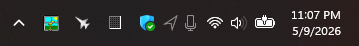
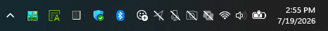
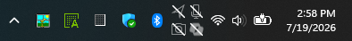
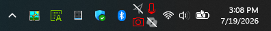
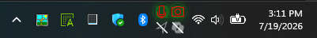
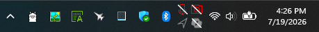
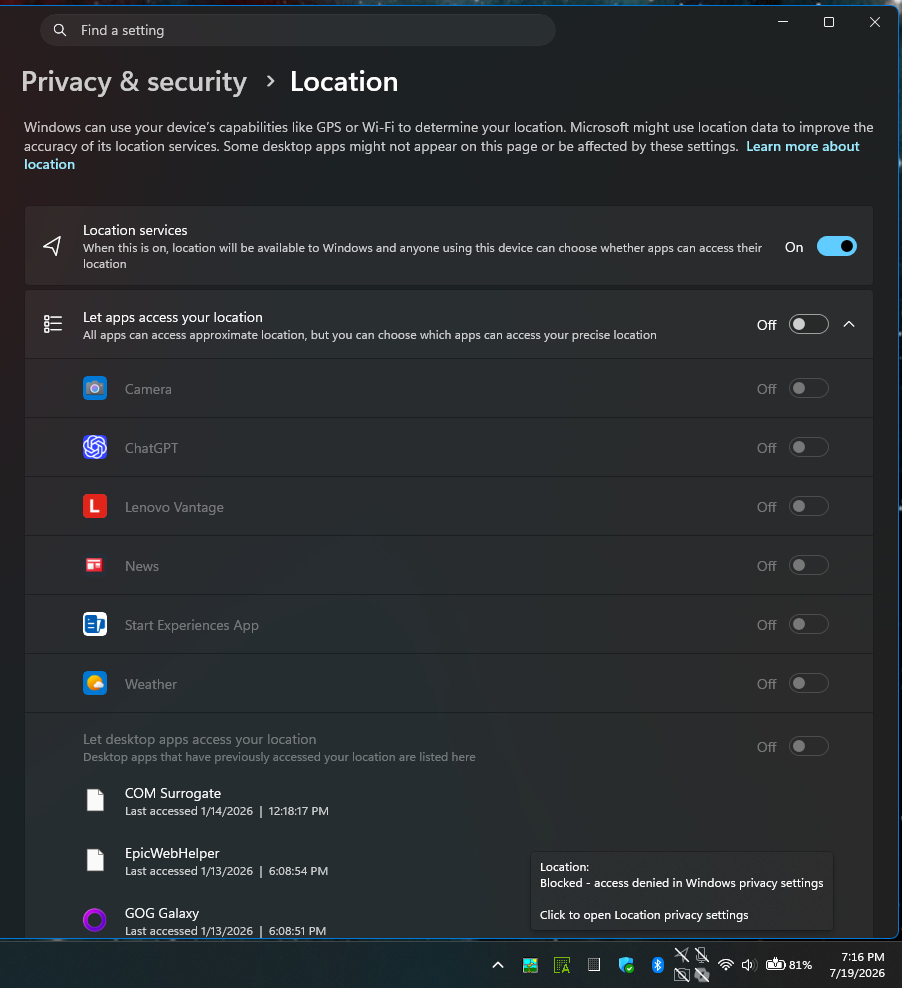
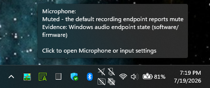
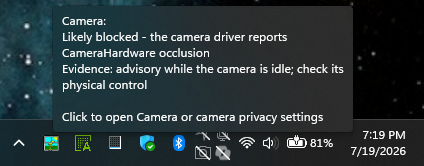
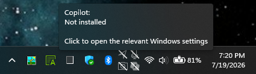

# Tray Privacy Indicator Anchor

A Windhawk mod for Windows 11 that reserves stable tray space for privacy and
status indicators. Location, microphone, camera, and Copilot placeholders stay
visible in the system tray: dim when idle, bright when active.

The goal is to stop taskbar tray sections from shifting when Windows briefly
shows or hides privacy indicators, especially when Windows Web Experience Pack
or Widgets frequently access location.

## Gallery

Idle location and microphone placeholders reserve their tray space without
demanding attention:



All four unavailable indicators in a single row:



The same four indicators in a compact Smart Grid layout:



Activity highlighted in red — the microphone in use, and the slashed camera
reporting attempted use while its hardware switch blocks it:



The active glow treatment provides a more emphatic alternative:



Active or requested pathways can remain conspicuous even while blocked:



The location tooltip explains the access-denied reason and opens the matching
Windows privacy page when clicked:



Microphone evidence distinguishes an endpoint mute from privacy denial:



Supported camera drivers report their hardware privacy-control evidence:



Copilot reports its installation state and links to the relevant settings:



## Features

- Persistent placeholder icons for location, microphone, camera, and Copilot
- Idle opacity setting so inactive icons can be subtle but still reserve space
- Configurable icon order with `location`, `mic`, `camera`, and `copilot` tokens
- Six Smart Grid modes with balanced, vertical-pack, and horizontal-pack layouts
- Short row/column placement and alignment controls
- Tray placement before icons, before OmniButton, before clock, after clock, or after Show Desktop
- Experimental placement immediately left or right of Start
- Per-icon X/Y nudges plus whole-group X/Y offset
- Independent idle, active, disabled, glow, and slash colors
- Steady, breathing, or radiating active emphasis with reach/speed controls
- Disabled slash overlays for blocked or unavailable privacy devices
- Hardware camera shutter/kill-switch detection on supported Windows 11 camera drivers
- Evidence-specific tooltips instead of a generic "hardware disabled" label
- Click-through to the relevant Windows privacy, input, camera, taskbar, or app settings
- Optional testing toggle to let Windows' native privacy indicators appear

## Icon order and grid layout

`itemOrder` is a comma-separated list of icon tokens that controls which icons
appear and in what sequence: `location`, `mic`, `camera`, `copilot`. Remove a
token to hide that icon; reorder tokens to change the display order.

`gridMode` selects Smart automatic, Single row, Single column, Fixed rows,
Fixed columns, or Fixed rows and columns. In Smart automatic mode,
`smartLayout` chooses Balanced, Pack vertical, or Pack horizontal. The default
Balanced layout picks the least-skewed shape that fits the live taskbar height.

`gridRows` and `gridColumns` provide the requested dimensions for the fixed
modes; `0` leaves that axis automatic. Smart automatic uses the live taskbar
height and icon pitch as its row capacity rather than treating these values as
an implicit mode selector.

When one row or column has fewer icons than the rest, use `shortGroupPosition`
and `shortGroupAlign` to control where it sits and how it's aligned:

| shortGroupPosition | shortGroupAlign | Result with location,mic,camera in 2 cols |
| --- | --- | --- |
| last (default) | center | `[loc  mic]` / `[  cam  ]` |
| first          | center | `[  loc  ]` / `[mic  cam]` |
| last           | start  | `[loc  mic]` / `[cam     ]` |
| last           | end    | `[loc  mic]` / `[     cam]` |

`fillOrder: columnFirst` fills columns instead of rows, giving vertical
arrangements like:

```
[loc] [cam]      [loc] [mic]
[mic] [   ]  or  [   ] [cam]   (short column centered)
```

## Placement

The five tray positions reserve a dedicated system-tray column. The
experimental `leftOfStart` and `rightOfStart` positions instead place the
owned indicator group beside Start and reserve matching room in the centered
taskbar items area. These Start-adjacent modes may need adjustment on future
Windows builds or with other mods that also reposition Start.

## States and colors

Each icon has four visual states: idle/available, active, disabled/unavailable,
and active while disabled. The last state keeps the active treatment underneath
the slash by default, so a muted or shuttered device still demands attention
when Windows reports attempted use. `alertWhenBlockedAndActive` can turn that
combined treatment off.

`idleColor`, `activeColor`, `disabledColor`, `glowColor`, and `slashColor`
accept `#RRGGBB` or `#AARRGGBB` hex (the alpha byte is honored), the generics
`accent`, `accentLight`, and `accentDark` for the Windows accent shades, or
`transparent`. An empty color uses the system foreground, except an empty
`glowColor`, which follows `activeColor` or the Windows accent color.

The glow can be a steady halo, a breathing pulse, or animated radiation rings.
Its opacity, reach, and speed are independent controls. The effect is drawn
inside the existing icon slot and never changes the taskbar width.

For a deliberately striking treatment, start with `glowStyle: radiate`,
`glowOpacity: 85`, `glowSize: 260`, and `glowSpeed: 850`, then choose an
`activeColor`/`glowColor` that fits the rest of the taskbar theme.

## Notes

Camera hardware-switch detection and the Copilot indicator are experimental
because Windows exposes those states differently across devices and builds.

Camera activity is detected from Windows webcam-usage records and any mirrored
native privacy state. Hardware camera blocking uses Windows 11
`CameraOcclusionInfo` when the camera driver supports it. Cameras without that
driver capability retain software-access and device-availability checks, but
their physical shutter or kill-switch state might not be detectable.

Windows documents idle-camera occlusion reports as advisory rather than an
absolute privacy guarantee. The tooltip therefore says "likely blocked" and
names the camera-driver evidence. `cameraHardwareDetection` can disable this
monitor. When enabled, it initializes the default camera controller in
`SharedReadOnly` mode but never starts preview or frame capture. Turn it off if
a particular camera activates its LED/indicator or behaves poorly while
monitored. State changes use the driver's native event; a five-minute watchdog
only checks that the subscription remains responsive. The controller is also
released when `camera` is removed from `itemOrder`.

Privacy access, usage records, policies, packages, and device topology are
monitored with Windows registry/device events rather than a three-second global
sweep. Copilot process activity is checked separately once per minute, and a
five-minute health reconciliation repairs any missed notification. Failed
camera and registry-monitor setup backs off from seconds to thirty minutes;
access-denied registry monitors remain disabled for the current mod session.

Each icon is clickable. Location opens Location privacy settings. Microphone
opens either microphone privacy or default-input settings according to the
reported reason. Camera opens either camera privacy or camera-device settings.
Copilot opens taskbar or installed-app settings.

`suppressNativeIndicators` defaults to `1` so the mod hides Windows' own pop-in
privacy indicators and mirrors state into the stable placeholders. Set it to `0`
temporarily when comparing against Windows' native tray glyphs during testing.
