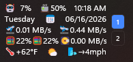

# Taskbar Clock Customization Spacer

Scratch integration copy for adding elastic spacer support to
`Taskbar Clock Customization`.

This folder is a lab staging area. The PR-ready change was moved into the fork
at:

`T:\Github\sb4ssman\m417z-windhawk-mods\mods\taskbar-clock-customization.wh.cpp`

Branch:

`taskbar-clock-elastic-spacer`

Commit:

`99c690f Add elastic spacer support to taskbar clock`

## What changed

- Adds `%s%` as an elastic spacer token for Windows 11 version 22H2 and newer.
- Supports `%s%` in the top and bottom clock lines.
- Uses the existing Windows 11 XAML text styling path to split clock text into
  generated line elements with star-sized spacer columns.
- Adds `{spacer}` for `WebContentWeatherFormat`, converted after fetching
  weather text so it does not conflict with wttr.in `%` format tokens.
- Leaves the normal formatter behavior intact; spacer rendering happens after
  formatted text reaches the taskbar TextBlocks.

## Tested locally

- Windhawk compile passed after fixing `GridUnitType` namespace usage.
- `%s%` tested in clock lines.
- `{spacer}` tested in weather format.
- Dense clock/weather/system-metric layout verified visually.
- `git diff --check` passed in the fork.

## PR direction

Open the pull request from the fork branch to upstream:

- Base repository: `m417z/my-windhawk-mods`
- Base branch: `main`
- Compare/head repository: `sb4ssman/m417z-windhawk-mods`
- Compare branch: `taskbar-clock-elastic-spacer`

Suggested title:

`Add elastic spacer support to Taskbar Clock Customization`
