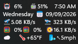

# Taskbar Clock Spacer

Adds a `%s%` elastic spacer token to the Windows 11 taskbar clock, so clock items
can be pushed apart to fill a fixed width instead of bunching together.


*User-confirmed working configuration, September 9, 2026, with system stats,
time, date, and weather arranged across a fixed-width clock.*

## Two requirements — please read before installing

**1. This mod does nothing on its own.** It is a companion for
[Taskbar Clock Customization](https://windhawk.net/mods/taskbar-clock-customization).
That mod produces the clock text; this mod only rearranges it. Install and
configure that mod first.

**2. The clock needs a fixed width.** An elastic spacer distributes *leftover*
width. If the clock sizes itself to its own text there is no leftover width,
every gap computes to zero, and the result looks exactly as if the mod were not
installed. Set a fixed width using either:

- **Max width** in Taskbar Clock Customization's settings, or
- **Max clock width** in this mod's settings.

Either one works. 120 px is a reasonable starting point.

Windows 11 only. This mod does not work on Windows 10.

## Try the built-in option first

Taskbar Clock Customization 1.8 and later can spread a line across a fixed
width on its own: set its **Text alignment** to **Justified**, use ordinary
spaces where you want the gaps, and use a non-breaking space inside items you
want kept together. If that looks right for your clock, you don't need this mod.

What `%s%` does that **Justified** does not:

- **Gaps only where you put them.** Justified stretches every space in the
  line, and can widen the spacing between characters — its author noted large
  gaps opening inside `MB/s`. With `%s%`, ordinary spaces and the characters
  inside each item are left exactly as they are.
- **Weighted gaps.** `%s%%s%` takes twice the share of a single `%s%`.
- **A minimum gap.** **Minimum spacer width** keeps every gap visible even when
  the text nearly fills the clock.
- **Gaps inside the weather.** `{spacer}` works inside the Weather format, where
  the weather text arrives as one pre-formatted string.

## What it does

Put `%s%` between items in the clock's Top Line or Bottom Line format. Each `%s%`
becomes a gap, and all leftover width is shared out evenly between the gaps.

| Format | Result |
| --- | --- |
| `%time%%s%%date%` | time hugs the left edge, date hugs the right, gap fills the middle |
| `%time%%s%%date%%s%%weekday%` | three items, two equal gaps |
| `%time%%s%%date%%s%%s%%weekday%` | Double-spacer: more space is weighted between date and weekday |

The first item always hugs the left edge and the last always hugs the right edge,
so the line stays anchored as the text changes width.

### Spacers inside the weather

The weather service substitutes `%s` as its sunset token, so `%s%` cannot be
written inside Taskbar Clock Customization's **Weather format**. Write
`{spacer}` there instead, for example:

```
%c{spacer}🌡️%t{spacer}🌬️%w
```

`{spacer}` passes through the weather service verbatim, arrives in the clock
line, and becomes the same elastic gap as `%s%` — so weather items justify
with the rest of the clock.

## Setup

1. Install **Taskbar Clock Customization** and set up your clock format.
2. Set a **Max width** in its settings, for example `120`.
3. Install this mod.
4. Edit the clock mod's **Top line** or **Bottom line** to put `%s%` between
   items, for example `%time%%s%%date%`.

The `%s%` token passes through Taskbar Clock Customization untouched and is
interpreted here at display time.

## Troubleshooting

**`%s%` disappears and nothing moves.** This is the fixed-width problem in
requirement 2 above. Set a **Max width** in Taskbar Clock Customization, or a
**Max clock width** here. The mod also writes a one-line explanation to the
Windhawk log the first time it detects this.

**Nothing happens at all.** Confirm Taskbar Clock Customization is installed and
enabled, and that `%s%` is in its **Top line** or **Bottom line** setting — not in
the tooltip, the middle line, or the weather format.

**The spacer works but the clock is the wrong width.** Adjust either the clock
mod's **Max width** or this mod's **Max clock width**. The latter applies only
to generated spacer rows, so leave it at `0` when you want the clock mod to
own the whole clock width.

## Settings

- **Max clock width** — fixed width for generated spacer rows. When it is `0`,
  the mod uses a finite **Max width** already set on the shared clock panel by
  Taskbar Clock Customization. It does not constrain an unspaced native line.
- **Minimum spacer width** — a floor, in pixels, for every gap. `0` (the default)
  leaves gaps fully elastic. A small value such as `8` guarantees a visible gap
  even before a fixed clock width is configured.

## Limitations

- `%s%` is interpreted after Taskbar Clock Customization expands its format
  tokens, so it works in the top and bottom line formats. Inside the composite
  weather segment use `{spacer}` instead — the weather service would consume
  `%s%` as its sunset token.
- Lines without `%s%` are left completely alone — the mod is a no-op for them.
- A line you hide in Taskbar Clock Customization stays hidden, even when its
  format contains `%s%`. Unhiding it takes effect on the next clock tick.
- Font, size, and color of the spaced segments follow the original clock text's
  current style, so the clock mod's style settings continue to apply.

## How it works

The mod hooks two system-tray symbols and watches the clock's time and date text
blocks. `DateTimeIconContent::OnApplyTemplate` catches every clock that is
templated from then on, including after Explorer rebuilds the taskbar;
`BadgeIconContent::get_ViewModel` catches the clocks that were already on screen
when the mod was enabled, on every monitor's taskbar. Between the two there is no
clock left to search for, so the mod needs no visual-tree scan.

When a line contains `%s%`, the source text block is collapsed and a generated
panel is inserted in its place: each line becomes a Grid whose text segments sit
in `Auto` columns separated by `Star` columns, and the star columns absorb the
leftover width. When only the text changes — which happens every second — the
existing segments are rewritten in place rather than rebuilt, so the visual tree
stays stable.

## Relationship to Taskbar Clock Customization

The spacer was first offered as a patch to Taskbar Clock Customization itself
([m417z/my-windhawk-mods#68](https://github.com/m417z/my-windhawk-mods/pull/68)).
Its maintainer preferred an approach without generated layout elements and
added the **Justified** text alignment described above, then judged creating
extra text elements to be out of scope for that mod. This companion carries the
explicit-gap approach separately and leaves Taskbar Clock Customization
untouched.
