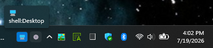
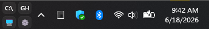
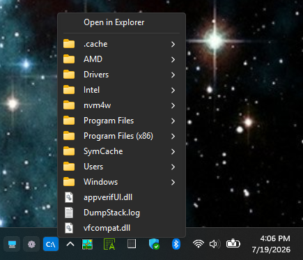

# Taskbar Folder Menus

A Windows 11-only mod that adds compact taskbar buttons which open Shell targets
as native popup menus, recreating the most useful part of the classic taskbar
toolbar workflow. Windows 10 is not supported.


*A minimal two-button setup for Desktop and Control Panel.*


*Hovering a compact button shows its configured Shell target.*


*Drive, GitHub, Desktop, and Control Panel shortcuts arranged in one row.*


*The same four shortcuts arranged vertically by the grid layout on a taller taskbar.*


*The Control Panel namespace opens directly as a native Shell menu with full icons.*


*A drive-root button opens the whole drive as a native cascading Shell menu.*

Click a small button to browse a folder, drive, Desktop, or Control Panel
directly from the taskbar — no minimizing required. Subfolders expand on
hover. Right-click any item for the full classic Windows Shell context menu.
Every folder popup includes an "Open in Explorer" shortcut at the top,
including the configured root folder.

## Example folder entries

```text
Label: 🖥    Target: shell:Desktop
Label: ⚙     Target: shell:ControlPanelFolder
Label: 📥    Target: %USERPROFILE%\Downloads
Label: C:    Target: C:\
```

Add one record per button in the Folders setting. Each record has a short button
label and a target. Targets can be normal paths or Shell namespace roots like
`shell:Desktop` and `shell:ControlPanelFolder`. Environment variables such as
`%USERPROFILE%` are expanded automatically. The full label and target appear in
the tooltip.

Emoji labels are a natural fit for narrow buttons. Label ideas: 📁 folder,
🖥 desktop, 💻 laptop, 🪟 windows, 📥 downloads, 🌐 network, 🗄 drive,
📄 documents, 🔧 tools, ⚙ settings, ⭐ favorites.

## Reordering folder buttons

For several existing records, open the mod's Settings page and switch to
**Textual mode**, then move each complete `label` + `target` record as a block.
The regular form currently provides add/remove controls but no direct
drag-to-reorder control.

## Settings

| Setting | Default | Description |
|---------|---------|-------------|
| Position | Before notification icons | Where to inject the button group in the tray |
| Folders | Desktop and Control Panel | Add/remove records in the form; reorder complete records in Textual mode |
| Grid mode | Smart automatic | Smart automatic, single row/column, fixed rows/columns, or fixed grid |
| Smart layout | Balanced | Balanced, pack vertical, or pack horizontal in smart mode |
| Grid columns | 0 (auto) | Exact columns in fixed-column modes; maximum columns in smart mode (0 = automatic) |
| Grid rows | 0 (auto) | Exact rows in fixed-row modes; maximum rows in smart mode (0 = tray height) |
| Fill order | Row-first | Row-first or column-first |
| Short row/column position | Last | Put an incomplete row or column first or last |
| Short row/column alignment | Start | Align an incomplete final row or column |
| Button width | 24 px | Width of each folder button |
| Button height | 22 px | Height of each folder button |
| Button spacing | 4 px | Gap between buttons |
| Default button text | 📁 | Fallback icon for entries with long labels |
| Text/icon size | 10 pt | Button label font size |
| Text color | *(system)* | Button label color; empty keeps the system default |
| Background color | *(system)* | Button background; empty keeps the system default |
| Hover background color | `accent` | Hover background; empty keeps the native hover color |
| Click background color | *(system)* | Pressed background; empty keeps the native pressed color |
| Border color | *(system)* | Button border; empty keeps the system default |
| Border thickness | -1 (system) | -1 = system default, 0 = no border |
| Corner rounding | -1 (system) | -1 = system default, 0 = square |
| Opacity | 100% | Button transparency |
| Shine effect | Off | Gradient highlight; activates when a custom background color is set |
| Group padding left | 0 px | Extra space to the left of the button group |
| Group padding right | 0 px | Extra space to the right of the button group |
| Group X offset | 0 px | Shift the entire group left or right |
| Group Y offset | 0 px | Shift the entire group up or down |
| Max menu items | 0 (unlimited) | Limit items shown per folder |
| Subfolder depth | 0 (unlimited) | How many subfolder levels to include |
| Show hidden/system items | Off | Include hidden and system Shell items |

All color settings accept `#RRGGBB` or `#AARRGGBB` hex (the alpha byte is
honored), the generics `accent`, `accentLight`, and `accentDark` for the
Windows accent shades, or `transparent` for a fully transparent surface —
nothing drawn, button still present and clickable, useful for borderless
background-free buttons. Leaving a color empty keeps the system default for
that state.

## Note on shell:Desktop

`shell:Desktop` shows the full Desktop Shell namespace — user shortcuts, public
shortcuts, and virtual items like Recycle Bin — not just the physical Desktop
folder. Duplicates from the user+public Desktop merge are suppressed automatically.
