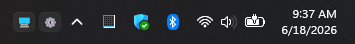
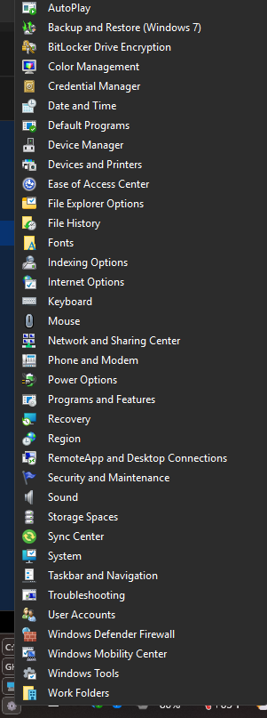
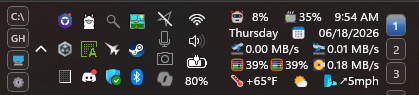

# Taskbar Folder Menus

A [Windhawk](https://windhawk.net) mod for Windows 11 that adds compact taskbar buttons for opening configured Shell targets as native popup menus.


*Two folder buttons — Desktop and Control Panel — injected into the system tray.*


*Control Panel open as a native Shell popup menu with full icons.*


*Four-button layout on a taller taskbar alongside a stats panel.*

Click a small button in the system tray to browse a folder, drive, Desktop, or Control Panel without minimizing any windows. Subfolders expand on hover with lazy loading, so even `C:\` opens instantly. Right-click any menu item for the full Windows Shell context menu. Every subfolder shows an "Open in Explorer" shortcut at the top of its popup.

This recreates the most useful part of the classic Windows taskbar toolbar workflow in a compact, tray-injected form.

## Features

- One or more configurable folder buttons injected into the system tray
- Native Shell popup menus backed by PIDLs — icons, virtual folders, and Shell items all work
- Subfolders expand on hover (lazy loading — only fetched when opened)
- "Open in Explorer" at the top of every subfolder menu
- Right-click any item for the full Windows Shell context menu
- Supports normal paths, drive roots, and Shell namespace roots (`shell:Desktop`, `shell:ControlPanelFolder`, etc.)
- Environment variables expanded in targets (`%USERPROFILE%`, `%SystemRoot%`, etc.)
- Configurable grid layout: row, column, or grid with fill order and alignment control
- Hover color defaults to `#4488FF`; all colors are overridable

## Settings

| Setting | Default | Description |
|---------|---------|-------------|
| Position | Before notification icons | Where to inject the button group in the tray |
| Folders | 🖥=shell:Desktop, ⚙=shell:ControlPanelFolder | Folder buttons: `Label=Target` per entry |
| Layout mode | Single row | Single row, single column, or grid |
| Grid columns | 2 | Columns used in grid mode |
| Grid rows | 0 (auto) | Rows in grid mode; 0 = derived from column count |
| Fill order | Row-first | Row-first or column-first |
| Short row/column alignment | Start | Align an incomplete final row or column |
| Button width | 32 px | Width of each folder button |
| Button height | 22 px | Height of each folder button |
| Button spacing | 4 px | Gap between buttons |
| Max menu items | 0 (unlimited) | Limit items shown per folder |
| Subfolder depth | 0 (unlimited) | How many subfolder levels to include |
| Show hidden/system items | Off | Include hidden and system Shell items |
| Default button text | 📁 | Fallback icon for entries with long labels |
| Text/icon size | 10 pt | Button label font size |
| Text color | *(system)* | Optional `#RRGGBB` or `#AARRGGBB` |
| Background color | *(system)* | Optional hex background |
| Hover background color | `#4488FF` | Highlight color when hovering a button |
| Click background color | *(system)* | Color while a button is pressed |
| Border color | *(system)* | Optional hex border color |
| Border thickness | -1 (system) | -1 = system default, 0 = no border |
| Corner rounding | -1 (system) | -1 = system default, 0 = square |
| Opacity | 100% | Button transparency |
| Shine effect | Off | Gradient highlight; activates when a custom background color is set |
| Group padding left | 0 px | Extra space to the left of the button group |
| Group padding right | 0 px | Extra space to the right of the button group |
| Group X offset | 0 px | Shift the entire group left or right |
| Group Y offset | 0 px | Shift the entire group up or down |

## Folder entry format

Each entry uses `Label=Target` form. Separate entries with newlines, `|`, or commas:

```text
🖥=shell:Desktop
⚙=shell:ControlPanelFolder
📥=%USERPROFILE%\Downloads
C:=C:\
```

Emoji labels are a natural fit for narrow buttons. Label ideas: 📁 folder,
🖥 desktop, 💻 laptop, 🪟 windows, 📥 downloads, 🌐 network, 🗄 drive,
📄 documents, 🔧 tools, ⚙ settings, ⭐ favorites.

The full label and target path appear in the button tooltip.

## Note on shell:Desktop

`shell:Desktop` shows the full Desktop Shell namespace — user shortcuts, public
shortcuts, and virtual items like Recycle Bin — not just the physical Desktop
folder. Duplicates from the user+public Desktop merge are suppressed automatically.

## Known limitations

- Only the primary taskbar is supported
- Some virtual Shell namespace items may not support right-click context menus

## Credits

**[windows-11-taskbar-styler](https://github.com/ramensoftware/windhawk-mods/blob/main/mods/windows-11-taskbar-styler.wh.cpp)** — reference for `SystemTrayFrameGrid` XAML tree structure.

**[Vertical OmniButton archive](../omnibutton-customizer/archive/vertical-omnibutton-v1.4.wh.cpp)** (this lab, by sb4ssman) — source of the `GetTaskbarXamlRoot` boilerplate, `RunFromWindowThread`, and injection patterns.

**[Windhawk](https://windhawk.net)** by [m417z](https://github.com/m417z) — the modding platform that makes all of this possible.
