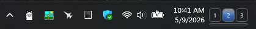
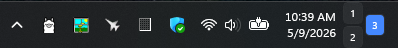
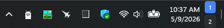
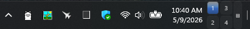
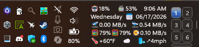
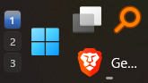
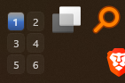
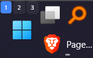
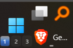
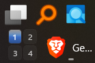

# Taskbar Virtual Desktop Switcher

A [Windhawk](https://windhawk.net) mod for Windows 11 that injects clickable buttons into the system tray — one per virtual desktop — for instant switching without opening Task View.

*Three desktops with the optional Task View master button as a lower sliver.*

*Default tray placement: three desktops in a row, desktop 1 active.*

*Compact tray placement with two desktops.*

*Four desktops with the optional Task View master button.*

*Taller taskbar: a dense grid with the master button as a lower sliver.*

*Start placement: switcher reserved to the left of Start.*

*Start placement with the Start button hidden.*

*Overlay mode can be nudged up with the vertical offset setting.*

*Overlay mode can also be nudged down.*

*Right-of-Start placement when the Start button is hidden.*

## Features

- Numbered, roman-numeral, dot, or custom-label buttons
- Smart grid layout with balanced, vertical-pack, horizontal-pack, and fixed override modes
- Highlights the active desktop immediately on switch
- Buttons appear/disappear as desktops are added or removed
- Five placement positions within the system tray, plus experimental Start-adjacent and Start-overlay positions
- Start placement modes: left of Start, over Start, and right of Start
- Configurable size, spacing, colors, opacity, and shine effect
- Per-state text color, font size, corner radius, bold, and border
- Tooltip on each button shows the desktop's display name
- Option to hide the bar entirely when only one desktop exists
- Experimental option to also show the switcher on secondary monitors' taskbars

## Settings

| Setting | Default | Description |
|---------|---------|-------------|
| Position | After clock | Where to place the switcher: system tray positions, left/right of Start, or over Start |
| Grid mode | Smart automatic | Smart, single row/column, fixed rows, fixed columns, or fixed grid |
| Smart layout | Balanced | Balanced, pack vertical, or pack horizontal |
| Fill order | Row-first | Row-first or column-first |
| Rows | 0 (auto) | Fixed rows, or max rows for smart mode when set |
| Columns | 0 (auto) | Fixed columns, or max columns for smart mode when set |
| Short group alignment | Center | Align a shorter last row/column to start, center, or end |
| Button width | 20 px | Width of each button |
| Button height | 22 px | Height of each button |
| Button spacing | 2 px | Gap between buttons in the grid |
| Label format | Numbers | Numbers · Roman numerals · Dots · Custom |
| Custom labels | *(empty)* | Comma-separated, e.g. `H,W,M` |
| Font size | 10 pt | Button label size |
| Active text color | *(native)* | Current desktop's label color |
| Inactive text color | *(native)* | Other desktops' label color |
| Active color | `accent` | Current desktop background; empty keeps the native surface |
| Inactive color | *(native)* | Other desktop backgrounds; empty keeps the native button surface |
| Hover background color | *(automatic)* | Forces one shared hover color; empty brightens each button's current background, native surfaces keep native hover |
| Click background color | *(automatic)* | Forces one shared pressed color; empty darkens each button's current background, native surfaces keep native pressed |
| Border color | *(native)* | Button border color |
| Border thickness | 0 px | Button border width |
| Corner radius | 4 px | Rounded corners (0 = square, 4 = Windows default) |
| Opacity | 100 | 0–100; lower values let the taskbar show through |
| Shine effect | Off | Gradient highlight on buttons with custom colors |
| Active bold | Off | Bold the current desktop's label |
| Padding left | 0 px | Extra space to the left of the button grid |
| Padding right | 2 px | Extra space to the right of the button grid |
| Hide when single | Off | Don't show the bar when only one desktop exists |
| Show on all taskbars | Off | Experimental: also inject into secondary monitors' taskbars (tray positions only; may need an Explorer restart after enabling) |
| Task View button | Off | Optional button that opens Task View for previewing, creating, or closing desktops |
| Task View button label | ⊞ | Text shown on the Task View button |
| Task View button position | After | Column before/after desktop buttons, or sliver row above/below |
| Task View button sliver height | 6 px | Height of the Task View button when used as a sliver row |
| Task View button column width | 14 px | Width of the Task View button when used as a side column |

All color settings accept `#RRGGBB` or `#AARRGGBB` hex (the alpha byte is
honored), the generics `accent`, `accentLight`, and `accentDark` for the
Windows accent shades, or `transparent` for a fully transparent surface —
nothing drawn, element still present and clickable. Leaving a color empty
keeps the native behavior described for that setting — including the Active
color, where empty means the current desktop's button keeps the plain native
surface with no highlight at all.

## Known limitations

- Multi-monitor support is experimental and off by default: secondary taskbars use the tray positions only (Start positions stay on the primary taskbar), and they are discovered as their tray icons load — after enabling the option, an Explorer restart (or toggling the mod off and on) may be needed before the buttons appear on other monitors
- Buttons may not appear until the mod injects on the first tray icon load; retry loop runs up to 5 times at 2-second intervals

## Credits and inspirations

This mod builds directly on patterns established by several community mods:

**[taskbar-empty-space-clicks](https://github.com/ramensoftware/windhawk-mods/blob/main/mods/taskbar-empty-space-clicks.wh.cpp)** — source of the `SwitchVirtualDesktop()` COM vtable pattern, build-specific IIDs for `IVirtualDesktopManagerInternal`, and the `IObjectArray` desktop enumeration approach.

**[taskbar-desktop-indicator](https://github.com/ramensoftware/windhawk-mods/blob/main/mods/taskbar-desktop-indicator.wh.cpp)** — reference for reading the current virtual desktop from the registry (session-scoped `VirtualDesktopIDs` + `CurrentVirtualDesktop` keys) and the notification cookie / `IVirtualDesktopNotificationService` registration pattern.

**[Vertical OmniButton archive](../omnibutton-customizer/archive/vertical-omnibutton-v1.4.wh.cpp)** (this lab, by sb4ssman) — source of the `GetTaskbarXamlRoot` boilerplate, `RunFromWindowThread` dispatcher, `FindCurrentProcessTaskbarWnd`, and the `IconView::IconView` hook-and-retry injection pattern.

**[windows-11-taskbar-styler](https://github.com/ramensoftware/windhawk-mods/blob/main/mods/windows-11-taskbar-styler.wh.cpp)** — reference for the `SystemTrayFrameGrid` XAML tree structure and element names (`ShowDesktopStack`, `NotificationCenterButton`, `ControlCenterButton`, `NotifyIconStack`).

**[Windhawk](https://windhawk.net)** by [m417z](https://github.com/m417z) — the modding platform that makes all of this possible.
