# Taskbar Virtual Desktop Switcher

A [Windhawk](https://windhawk.net) mod that adds clickable taskbar buttons — one per virtual desktop — for instant switching without opening Task View. Windows 11 uses the system tray; Windows 10 uses native tray windows.

## Windows 10 compatibility (local test candidate)

The Windows 10 backend targets the native 64-bit taskbar on builds 19041–19045
(Windows 10 2004 through 22H2). The previous local build was accepted for
personal experimental use. The new compact automatic grid needs a live test;
appearance remains imperfect and exhaustive edge/lifecycle testing is still
outstanding. It uses the
same desktop labels, arrangement, sizes, padding, offsets, Task View button,
colors, fonts, and hover previews as the Windows 11 backend. Desktop creation,
removal, renaming, and switches made elsewhere are checked every 250 ms.

The classic taskbar reserves space through the native clock's layout, so app
buttons give up only the needed width. It does not add rebar toolbar bands.
Moving or resizing the taskbar rebuilds the layout;
automatic layouts fit its height at the top/bottom and its width at the sides.
Disabling the mod restores native tray geometry and releases the reservation.
The native clock-size symbol must be available; initialization fails safely
if it cannot be hooked.

Windows 10 differences in this experimental backend:

- **Position (Windows 10 experimental)** offers three locations: before the
  hidden-icons chevron (before tray icons when the chevron is hidden), between
  clock and notifications, or between notifications and Show Desktop.
  **Position (Windows 11)** is ignored on Windows 10.
- Notifications must be present for the position after notifications. If the
  native host is unavailable, the switcher waits for it rather than overlapping
  another control. Side taskbars still need placement testing.
- Only the primary taskbar is supported; **Show on all taskbars (Windows 11)**
  applies to Windows 11 only.
- The buttons use Win32 drawing; Windows 11 Taskbar Styler selectors and native
  XAML checked states apply to Windows 11 only. The toolbar lets the actual
  taskbar background show through, including its color and transparency.
  Idle buttons are transparent by default; the active desktop has a subtle
  accent tint and underline, with soft hover/press feedback. Text follows the
  system light/dark theme; high contrast uses system colors. Existing color
  overrides remain optional; no additional appearance settings are needed.
- A manual arrangement larger than the taskbar can be clipped. Very crowded
  taskbars need a smaller button size or arrangement.

The screenshots below show the Windows 11 backend.

**Stacks and grids on Windows 10.** The same `Layout` → `Arrangement` field
works here: `1, 2` stacks two desktops; `1, 2 | 3, 4` makes a 2×2 grid.
With `auto` and **Fill columns first**, buttons can compact across the
taskbar to fit a readable column or grid. The configured height is a preferred
maximum on a horizontal taskbar; width is a preferred maximum on a side
taskbar. With the default font and zero padding, two desktops can stack on a
normal 40 px taskbar without manually reducing the default 22 px height.
Four can form a 2×2 grid. Larger fonts, padding and a Task View sliver can
reduce how many lines fit. A taller taskbar allows more lines; `auto` refits
when it changes. **Fill rows first** keeps the configured button sizes.

Manual arrangements keep their exact shape and sizes. For a manual two-row
stack on a 40 px taskbar, use 18 px height, 2 px spacing and zero vertical
padding: the group needs 38 px. Manual arrangements never shrink automatically.

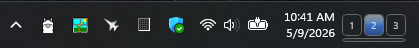
*Three desktops with the optional Task View button as a lower sliver.*

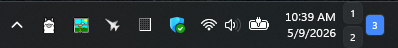
*Default tray placement: three desktops in a row, desktop 1 active.*

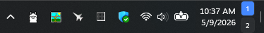
*Compact tray placement with two desktops.*

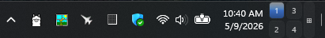
*Four desktops with the optional Task View button.*

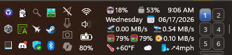
*Taller taskbar: a dense grid with the Task View button as a lower sliver.*

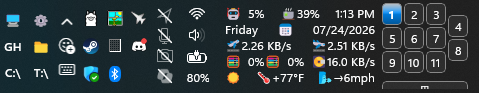
*Eleven desktops on a double-height taskbar, with a restyled Task View button
and several other taskbar mods alongside. `auto` fits the grid to the height it
is given rather than to a desktop count.*

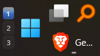
*Start placement: switcher reserved to the left of Start.*

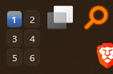
*Start placement with the Start button hidden.*

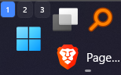
*Overlay mode can be nudged up with the vertical offset setting.*

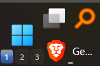
*Overlay mode can also be nudged down.*

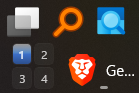
*Right-of-Start placement when the Start button is hidden.*

## Features

- Numbered, roman-numeral, indicator-symbol, or custom-label buttons
- Automatic grid that fits the buttons to the taskbar's height, or an arrangement you write yourself
- Optional Task View button as a full column, a sliver, or one more button in the grid
- Highlights the active desktop immediately on switch
- Buttons appear and disappear as desktops are added or removed
- Five tray positions, plus experimental Start-adjacent and Start-overlay positions
- Configurable size, spacing, colors, opacity, and shine effect
- Per-state text color, font size and family, corner radius, bold, and border
- Native checked states that can be targeted by Windows 11 Taskbar Styler
- Tooltip on each button shows the desktop's display name
- Option to hide the bar entirely when only one desktop exists
- Experimental option to also show the switcher on secondary monitors' taskbars

## Upgrading from 1.x

Version 2.0 reorganizes every setting into groups — Placement, Content, Layout,
Size, Adjust, Surface, State, Behavior — so this mod matches the rest of the
family. Windhawk cannot carry values across renamed keys, so **your previous
customizations are not migrated; re-apply them once after updating.** Before
updating, copy your settings from the mod's Settings page in **Textual mode**
so you have them to hand.

The layout settings collapsed into a single **Arrangement** field. Grid mode,
smart layout, rows, columns, primary axis, cross alignment, the four padding
sides, the vertical offset, and both nudge strings are gone; see below for what
replaced them.

## The Arrangement field

`Layout` → `Arrangement` decides how the buttons are placed, and it is the only
field that does. Its default value is the word `auto`:

- **`auto`** fits the buttons to the available taskbar height. `Fill order`
  chooses whether they fill across rows or down columns; `Short row or column`
  aligns a ragged last group. The shape itself is worked out for you: the mod
  takes the narrowest grid that fits the height, preferring the one that wastes
  the fewest slots — four desktops on a double-height taskbar become a 2×2
  block, not a lopsided 3+1.
- **Anything else** is an arrangement you write. Names sit side by side with
  `|` and stack with `,`, and parentheses group them:

  ```text
  1, 2 | 3, 4        a 2x2 block
  1 | 2 | 3 | 4      a single row
  1, 2, 3, 4         a single column
  master | (1, 2)    Task View button left of a stacked pair
  ```

  Order of operations: parentheses first, then `,`, then `|` — so
  `1 | 2, 3 | 4` is three columns with `2` stacked over `3`.

  Buttons are named by desktop number; the Task View button is `master` or
  `taskview`. `desktop2` also works as a readable alias for `2`, and names are
  case-insensitive. A separator is always required — `1 (2 | 3)` is an error,
  not a shorthand for `1 | (2 | 3)`.

Every time the layout is applied, the arrangement `auto` produced is written to
the Windhawk log, along with which desktop each number refers to
(`tokens: 1=Home  2=Work`). Copy the arrangement line into the Arrangement
field and you have the automatic layout as a starting point to edit — the
automatic and manual paths are the same field and the same syntax. If what you
write doesn't parse, the log says what was expected and where, and the
automatic arrangement is used until you fix it.

**Nudging.** Append a pixel offset to any name to move just that button:

```text
1[+2,-1] | 2 | 3       desktop 1 moves 2px right and 1px up
(1, 2) | master[0,2]   Task View button drops 2px
```

A parenthesized group takes an offset too, moving everything inside it:

```text
(1, 2)[3,0] | 3        the stacked pair moves 3px right, 3 stays put
```

Offsets are cosmetic. Nothing else shifts, and the group's overall size does
not change. To move the whole group instead, use `Adjust` → horizontal and
vertical offset. Nudges and offsets are screen pixels on every taskbar edge —
see [Taskbar position](#taskbar-position).

**Desktops you create later.** An arrangement you write names the desktops that
existed when you wrote it. Create another one and it is in no group, so by
default it is appended after your arrangement rather than vanishing — the log
says when that happened, so you can fold it in when you next edit. Set
`Layout` → `Newly created desktops` to *Leave them out* if you would rather
your arrangement be the whole truth. `auto` always includes every desktop.

## Desktop hover previews

Hover a desktop button for 400 ms to see an overview of that desktop's open
windows. The preview keeps their relative positions across your monitors and
shows the desktop name. It does not switch desktops or take keyboard focus;
click the desktop button to switch as usual. Moving away or clicking closes it.

Previews are enabled by default. In **Behavior**, turn **Desktop hover previews**
off to return to desktop-name tooltips, adjust **Preview delay** (100–2000 ms),
or set **Preview width** (200–800 px, scaled for the monitor).

The overview uses Windows' window thumbnails on a neutral background that
follows your Windows light/dark theme, with rounded corners to match the
shell; it is not a screenshot of the wallpaper or Task View. Minimized windows are counted
rather than shown. Windows may provide a blank or last-rendered image for
protected, suspended, or inactive-desktop applications. An empty desktop is
labelled explicitly. Window membership and positions are refreshed on each
hover; the thumbnails themselves are maintained by Windows while visible.
Windows pinned across desktops may only appear on their assigned desktop.

## The Task View button

`Content` → `Task View button placement` decides where it goes: a column
**before** or **after** the desktop buttons, a row **above** or **below** them,
or the **last button in the grid**. This applies whether the layout came from
`auto` or from an arrangement you wrote — write `master` in your arrangement
and you place it exactly, and the setting steps aside.

For the column and row placements, `Size` → `Task View button thickness` is how
thick it is: its **width** as a column, its **height** as a row. `Task View
button length` is how far it runs along the desktop buttons, and `0` — the
default — means match them exactly, so it is a full-height column or a
full-width sliver however many desktops you have. Give the length a value to
make it shorter; it is then centered by `Short row or column`.

`Task View button gap` puts extra distance between it and the desktop buttons,
on top of the normal spacing — positive pushes it further away whichever side
it is on, negative pulls it closer or over them. It moves the button **without
resizing the group**, which is the useful part: push a sliver below far enough
and it hangs past the bottom of the taskbar so only its leading edge shows,
rather than the whole group growing and re-centering. On a column, a few pixels
of gap simply sets it apart from the set.

**Last button in the grid** ignores thickness, length, and gap, and sizes it
like a desktop button so it flows with them as one more cell — `1, 4 | 2, 5 |
3, ⊞`. Use it when you want the Task View button to read as part of the set
rather than as a bar alongside it; it keeps its own label and font.

All of this applies when the arrangement does not name the button. Write
`master` yourself and you are placing it — add your own offset there if you
want the gap, like `(1 | 2 | 3), master[0,8]`.

## Settings

### Placement

| Setting | Default | Description |
|---------|---------|-------------|
| Position (Windows 11) | After clock | Tray position, or left of / over / right of Start; ignored on Windows 10 |
| Position (Windows 10 experimental) | Before hidden-icons chevron | Before chevron, between clock and notifications, or between notifications and Show Desktop; ignored on Windows 11 |
| Show on all taskbars (Windows 11) | Off | Experimental; also injects into secondary monitors' taskbars; Windows 10 supports the primary taskbar only |

### Content

| Setting | Default | Description |
|---------|---------|-------------|
| Label format | Numbers | Numbers · Roman numerals · Indicator symbols · Custom labels |
| Custom labels | *(empty)* | Comma-separated, e.g. `H,W,M` |
| Active indicator symbol | ● | Current desktop's symbol in Indicator symbols mode |
| Inactive indicator symbol | ○ | Other desktops' symbol; paste 🟢 above and 🔴 here for a stoplight |
| Task View button | Off | Adds a button that opens Task View for previewing, creating, or closing desktops |
| Task View button label | ⊞ | Text shown on that button |
| Task View button placement | After | Column before/after, row above/below, or last button in the grid |

### Layout

| Setting | Default | Description |
|---------|---------|-------------|
| Arrangement | `auto` | `auto`, or an arrangement you write — see above |
| Fill order | Fill rows first | Used by `auto`; on Win10, columns first also compacts across taskbar thickness to fit readable lines |
| Short row or column | Center | Used by `auto`; start, center, or end |
| Newly created desktops | Add them after | Or leave them out; only applies to a written arrangement |

### Size

| Setting | Default | Description |
|---------|---------|-------------|
| Button width | 20 px | Preferred maximum for Win10 columns-first `auto` on side taskbars; otherwise exact |
| Button height | 22 px | Preferred maximum for Win10 columns-first `auto` on horizontal taskbars; otherwise exact |
| Button spacing | 2 px | Gap between buttons along each axis |
| Task View button thickness | 14 px | Width as a column, height as a sliver; unused in the grid placement |
| Task View button length | 0 px | 0 matches the desktop buttons exactly |
| Task View button gap | 0 px | Extra distance from the desktop buttons; moves it without resizing the group |

### Adjust

| Setting | Default | Description |
|---------|---------|-------------|
| Horizontal padding | 0 px | Reserved on both sides of the group |
| Vertical padding | 0 px | Reserved above and below the group |
| Horizontal offset | 0 px | Moves the group; reserves no space |
| Vertical offset | 0 px | Moves the group up (negative) or down (positive) |

### Surface

| Setting | Default | Description |
|---------|---------|-------------|
| Font size | 10 pt | |
| Font family | *(native)* | For desktop labels and indicator symbols |
| Hover background color | *(automatic)* | Empty brightens each button's own background |
| Click background color | *(automatic)* | Empty darkens each button's own background |
| Border color | *(native)* | |
| Border thickness | 0 px | |
| Corner radius | 4 px | 0 = square, 4 = Windows default |
| Opacity | 100 | Lower values let the taskbar show through |
| Shine effect | Off | Gradient highlight on buttons with custom colors |
| Task View font family | *(native)* | Independent font for the Task View label |

### State

| Setting | Default | Description |
|---------|---------|-------------|
| Active desktop text color | *(native)* | |
| Inactive button text color | *(native)* | |
| Active desktop color | `accent` | Empty keeps the plain native surface |
| Inactive button color | *(native)* | |
| Bold the active desktop label | Off | |

### Behavior

| Setting | Default | Description |
|---------|---------|-------------|
| Desktop hover previews | On | Overview of the hovered desktop without switching |
| Preview delay | 400 ms | Clamped to 100–2000 ms |
| Preview width | 320 px | Clamped to 200–800 px; monitor-scaled |
| Hide when only one desktop | Off | |

All color settings accept `#RRGGBB` or `#AARRGGBB` hex (the alpha byte is
honored), the generics `accent`, `accentLight`, and `accentDark` for the
Windows accent shades, or `transparent` for a fully transparent surface —
nothing drawn, element still present and clickable. Leaving a color empty
keeps the native behavior described for that setting — including the Active
desktop color, where empty means the current desktop's button keeps the plain
native surface with no highlight at all.

## Taskbar position

Windows 11 can put the taskbar on any edge (Settings → Personalization →
Taskbar → Taskbar behaviors, on builds that have the setting). The mod reads
the edge Windows reports and rebuilds the bar when the taskbar moves.

- **Top** behaves exactly like bottom.
- **Left or right**: an arrangement you write is laid out exactly as
  written - `|` side by side, `,` stacked - and every `[dx,dy]` nudge
  moves a button `dx` right and `dy` down, on every edge. `auto` fits the
  taskbar's width instead of its height, filling rows first or columns
  first as set. Nothing is mirrored between left and right. The Task View button's
  *before/after* and *above/below* are screen places too. The taskbar is
  wide enough that a handful of desktops fit in one row across it, and
  then `Fill order` and *Short row or column* have nothing to change.
  *Left of Start* and *Right of Start* become above and below Start, and
  the hover preview opens beside the button instead of above it.
- A taskbar rotated by another mod (for example Vertical Taskbar with its
  native mode turned off) is left untouched; the log says so.

## Taskbar Styler

Desktop buttons are XAML `ToggleButton` controls named `VdBtn_0`, `VdBtn_1`,
and so on. The current desktop has `IsChecked=true`, exposing the native
`Checked`, `CheckedPointerOver`, and `CheckedPressed` states. Taskbar Styler
can target every indicator's template presenter with:

```text
Grid#VdSwitcherBar > ToggleButton > ContentPresenter#ContentPresenter@CommonStates
```

State-qualified styles such as `Background@Checked`,
`Background@CheckedPointerOver`, and `Background@CheckedPressed` then apply
without inferring the active desktop from its color.

## Known limitations

- Multi-monitor support is experimental and off by default: secondary taskbars use the tray positions only (Start positions stay on the primary taskbar), they follow the primary taskbar's edge, and they are discovered as their tray icons load — after enabling the option, an Explorer restart (or toggling the mod off and on) may be needed before the buttons appear on other monitors
- Buttons may not appear until the mod injects on the first tray icon load; retry loop runs up to 5 times at 2-second intervals

## Credits and inspirations

This mod builds directly on patterns established by several community mods:

**[taskbar-empty-space-clicks](https://github.com/ramensoftware/windhawk-mods/blob/main/mods/taskbar-empty-space-clicks.wh.cpp)** — source of the `SwitchVirtualDesktop()` COM vtable pattern, build-specific IIDs for `IVirtualDesktopManagerInternal`, and the `IObjectArray` desktop enumeration approach.

**[taskbar-desktop-indicator](https://github.com/ramensoftware/windhawk-mods/blob/main/mods/taskbar-desktop-indicator.wh.cpp)** — reference for reading the current virtual desktop from the registry (session-scoped `VirtualDesktopIDs` + `CurrentVirtualDesktop` keys) and the notification cookie / `IVirtualDesktopNotificationService` registration pattern.

**[taskbar-clock-customization](https://github.com/ramensoftware/windhawk-mods/blob/main/mods/taskbar-clock-customization.wh.cpp)** — reference for the Windows 10 clock minimum-size hook and native taskbar relayout.

**[Vertical OmniButton archive](../omnibutton-customizer/archive/vertical-omnibutton-v1.4.wh.cpp)** (this lab, by sb4ssman) — source of the `GetTaskbarXamlRoot` boilerplate, `RunFromWindowThread` dispatcher, `FindCurrentProcessTaskbarWnd`, and the `IconView::IconView` hook-and-retry injection pattern.

**[windows-11-taskbar-styler](https://github.com/ramensoftware/windhawk-mods/blob/main/mods/windows-11-taskbar-styler.wh.cpp)** — reference for the `SystemTrayFrameGrid` XAML tree structure and element names (`ShowDesktopStack`, `NotificationCenterButton`, `ControlCenterButton`, `NotifyIconStack`).

**[Windhawk](https://windhawk.net)** by [m417z](https://github.com/m417z) — the modding platform that makes all of this possible.
