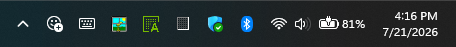
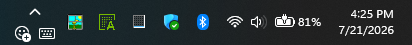
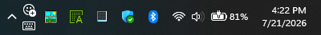
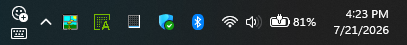
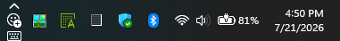
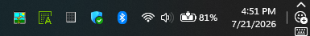
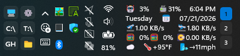
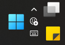

# Tray Utility Customizer

Granular, predictable control over the low-frequency Windows 11 system-tray
utility icons:

- **Show hidden icons** (the overflow chevron) — token `overflow`
- **Emoji and more** — token `emoji`
- **Touch keyboard** — token `touchKeyboard`
- **Pen menu** — token `penMenu`
- **Virtual touchpad** — token `virtualTouchpad`
- **Input/language indicator** — token `inputIndicator`

The native controls stay alive and Windows-owned — clicks, flyouts, and
tooltips are untouched. The mod gathers their hosts into one owned group and
positions each icon individually, at its native size by default.

*Mod disabled: the chevron, Emoji, and touch keyboard sit in their native positions.*

*One row of three at native size — what `auto` produces on a single-height taskbar, and what `overflow | emoji | touchKeyboard` produces anywhere.*

*`overflow, (emoji | touchKeyboard)`: the chevron centered on its own row above the pair.*

*The chevron leading a stacked pair.*

*The same stack with the chevron last instead.*

*A full single column of utilities on a single-height taskbar.*

*The group leased into its own tray column at the right end of the taskbar.*

*Coexisting with a heavily modded double-height tray.*

*The experimental Right of Start position — unnecessary, but possible.*

*Right of Start on a double-height taskbar, stacked as a column beside Start.*

## Upgrading from 1.x

**Version 2.0 renames every setting, and your old values do not carry over.**
The mod now uses the same grouped settings contract as the rest of this family
(`Placement.Position`, `Layout.Arrangement`, `Size.ItemWidth`, and so on), and
Windhawk cannot carry a value across a renamed key. Everything returns to its
default, including the arrangement.

Two things are worth knowing before you retype your layout:

- **The primary-axis setting is gone.** `|` is now ALWAYS horizontal and `,` is
  ALWAYS vertical, at every depth. If you had Primary axis set to **Column**,
  your old expression means its transpose under the new grammar — swap `|` and
  `,` when you re-enter it. If you were on Row, the string means exactly what
  it did before.
- **The twelve per-icon nudge settings are gone.** A nudge now rides in the
  arrangement itself: `emoji[+2,-1]`. One string, nothing to keep in sync.

Nothing is silently reinterpreted — because the keys are new, the mod starts
from `auto` rather than reading your old string with new rules.

## Arrangement

One string describes the whole layout, under `Layout` → `Arrangement`:

- `|` places items **side by side**, always
- `,` stacks them **on top of each other**, always
- parentheses nest, to any depth
- `name[dx,dy]` nudges one item; `(a, b)[dx,dy]` nudges a whole group
- every group is centered against its siblings (see `Layout.Justify`)

Examples:

- `overflow | emoji | touchKeyboard` — one row of three icons
- `overflow, emoji, touchKeyboard` — a single column
- `overflow | emoji, touchKeyboard` — chevron beside a stacked pair
- `overflow | emoji, touchKeyboard | penMenu` — the diamond: two icons
  flanking a stacked middle column
- `overflow[0,-2] | emoji` — the same row with the chevron nudged up 2px

The default is the word **`auto`**, which fits the utilities you enabled to
the taskbar's height: it takes the fewest columns that fit in the rows
available, and `Layout.FillOrder` decides whether items fill across or down.
Every time `auto` runs it writes the expression it generated to the Windhawk
log, so you can paste that into the field and edit it.

A separator is always required — `overflow (emoji | touchKeyboard)` is a parse
error rather than an implied `|`, so a typo shows up in the log instead of
silently becoming a different layout. A parse error falls back to `auto`.

Tokens accept forgiving aliases: `chevron`/`hidden` for `overflow`,
`keyboard` for `touchKeyboard`, `pen` for `penMenu`, `touchpad` for
`virtualTouchpad`, and `input`/`language` for `inputIndicator`. An unknown
token is named in the log rather than silently dropped.

**Items your arrangement does not name.** Windows shows and hides these
utilities live — the touch keyboard comes and goes, and the taskbar settings
toggle the rest — so an arrangement you wrote earlier can be missing one.
`Layout.NewItems` decides what happens then: **append** (the default) arranges
them after what you wrote and logs that it did, and **ignore** leaves them out
until you add them yourself.

## Which utilities participate

The `Content` group has one switch per utility. All six are on by default:
a utility Windows is not currently showing contributes nothing either way, and
on most machines the pen menu, virtual touchpad and input indicator are simply
absent. Turn one off to leave it in its native position.

## Size and adjustment

Icons render at their native size unless you set `Size.ItemWidth` /
`Size.ItemHeight`. A tall column of native-size icons can overhang a
single-height taskbar; about 16 px makes it fit.

`Size.ItemSpacing` is the gap between items and may be negative to pull them
together. `Adjust.PadX` / `PadY` reserve space at the outside edges of the
group and participate in layout — raising `PadY` gives `auto` fewer rows to
work with. `Adjust.OffsetX` / `OffsetY` move the whole group visually and
reserve nothing.

## Position

`Placement.Position` puts the group in the hidden-icons column (the default —
that is where these utilities already are), the Emoji column, or a dedicated
leased tray column before the notification icons, before Wi-Fi/volume/battery,
before or after the clock, or after the Show Desktop strip. The lease is
marker-tracked and fully reversible on unload.

Two **experimental** positions relocate the group out of the tray entirely:
**Left of Start** and **Right of Start** place it beside the Start button and
push the task list right to reserve room. The group follows Start as the
taskbar re-centers. Primary taskbar only.

## Detection

Icons are identified by Windows' language-neutral runtime data-model classes,
XAML names and content types, Automation IDs, and stable Segoe Fluent glyphs.
Detection doesn't depend on translated accessibility labels.
`Behavior.Detection` → **Force MainStack** allows the complete native
`MainStack` to participate as the `emoji` item when Windows doesn't expose a
distinct identity.

## Settings

| Setting | Default | What it does |
|---|---|---|
| `Placement.Position` | `overflow` | Which tray column (or Start-adjacent spot) the group occupies |
| `Content.*` | all on | One switch per utility: may it join the arrangement |
| `Layout.Arrangement` | `auto` | The layout expression, or `auto` |
| `Layout.FillOrder` | `rows` | Used by `auto`: fill across rows or down columns |
| `Layout.Justify` | `center` | How a ragged row or column aligns against its siblings |
| `Layout.NewItems` | `append` | What happens to a utility a written arrangement doesn't name |
| `Size.ItemWidth` | `0` | 0 = the size Windows drew it at |
| `Size.ItemHeight` | `0` | 0 = native; ~16 fits a column on a single-height taskbar |
| `Size.ItemSpacing` | `0` | Gap between items; negative pulls them together |
| `Adjust.PadX` / `PadY` | `0` | Space reserved at the group's edges; participates in layout |
| `Adjust.OffsetX` / `OffsetY` | `0` | Moves the group visually; reserves nothing |
| `Behavior.MinimumTrayHeight` | `44` | Below this tray height the mod leaves everything native |
| `Behavior.Detection` | `auto` | Guarded detection, or Force MainStack |
| `Behavior.DetailedLogging` | off | Tray hosts, glyph codepoints, and computed placements |

## Taskbar position

Windows 11 only puts the taskbar at the bottom, but two mods move it:

- **[taskbar-on-top](https://windhawk.net/mods/taskbar-on-top) — supported.**
  Nothing here positions against screen coordinates; everything is relative to
  the taskbar's own XAML tree.
- **[taskbar-vertical](https://windhawk.net/mods/taskbar-vertical) — not
  compatible.** It rotates the same tray elements this mod positions, through
  the same `RenderTransform` property. One property, two owners. This mod
  detects a vertical taskbar, **leaves it completely untouched**, and says so
  in the log rather than painting a rotated mess.

## Known limitations

- The utility flyouts (the Emoji panel, the hidden-icons overflow) are
  positioned by Windows itself from the icon's location; at extreme
  screen-edge positions they can open partially off-screen. Prefer the
  tray positions if this bothers you.
- Left/Right of Start are experimental. The centered taskbar re-flows with
  an animation, and the group can briefly sit at a stale position until
  the taskbar's next layout pass settles it.

## Changelog

### 2.0

- Adopted the shared settings contract: every key moved into a `Placement` /
  `Content` / `Layout` / `Size` / `Adjust` / `Behavior` group. **This is a
  clean settings break — see "Upgrading from 1.x" above.**
- One `Layout.Arrangement` field replaces the layout expression, the primary
  axis, the group alignment, and all twelve per-icon nudge settings. `|` is
  always horizontal and `,` always vertical; nudges ride in the expression.
- Added `auto`, which fits the enabled utilities to the taskbar height and
  logs the expression it generated so it can be pasted back and edited.
- Added `Content` switches per utility and `Layout.NewItems`, so a utility
  that appears after you wrote your arrangement is not silently lost.
- Added `Adjust.PadX` / `PadY` / `OffsetX` / `OffsetY`.
- Row capacity is now computed in DIPs from the taskbar's real DPI instead of
  raw pixels, so the automatic shape is correct at 125% and 150% scaling.
- A vertical taskbar is now detected and the mod stands down completely
  instead of arranging into a rotated coordinate space.
- Restoring a borrowed element now puts back its exact previous local value,
  or clears the property when it had none, instead of writing back a value
  read from the live element. A tray element whose size or alignment came from
  its template keeps that binding when the mod unloads.
