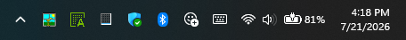
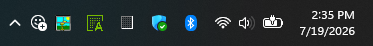
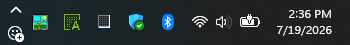

# Tray Utility Customizer

Arranges low-frequency Windows 11 system-tray utility controls into one compact
row, column, or smart grid:

- **Show hidden icons** (the overflow chevron)
- **Emoji and more** (emoji, GIF, kaomoji, symbols, and clipboard history)
- **Touch keyboard**
- **Pen menu**
- **Virtual touchpad**
- **Input/language indicator**

Only controls detected on the current Windows build are included. The mod keeps
Windows-owned controls intact and moves their native tray hosts instead of
drawing replacement buttons or forwarding clicks.

*Mod disabled: the chevron and the Emoji button sit in their native positions.*

*Enabled: the Emoji button is gathered in next to the chevron.*

*Smart automatic stacks the pair into a column once the taskbar is tall enough.*

## Layout

- **Smart automatic** picks the densest sensible grid for the item count and
  the current taskbar height, tuned by the Smart layout preference (balanced,
  pack vertical, or pack horizontal). It never exceeds the tray height.
- **Single row** and **Single column** are exactly that.
- **Fixed rows / Fixed columns / Fixed grid** honor the requested shape even if
  it is taller than the tray; use the minimum tray height guard to keep short
  taskbars native.

When the last grid row or column is not full, the short group can be placed
first or last and aligned to the start, center, or end.

## Position

The group can borrow the hidden-icons or Emoji column, or lease a dedicated
tray column before the notification icons, before Wi-Fi/volume/battery, before
or after the clock, or after the Show Desktop strip. The lease is
marker-tracked and fully reversible on unload.

Two **experimental** positions relocate the group out of the tray entirely:
**Left of Start** and **Right of Start** move the native hosts into a small
overlay beside the Start button and push the task list right to reserve room.
The group follows Start as the taskbar re-centers and everything returns to
the tray on unload. Primary taskbar only.

## Detection

- **Automatic** uses Windows accessibility metadata and a guarded Emoji
  fallback.
- **Force MainStack** allows the complete native `MainStack` to participate
  when Windows doesn't expose useful metadata. It can include unrelated
  indicators.

Use `itemOrder` to select and order utilities. If multiple selected utilities
belong to one indivisible Windows host, they stay bundled together and the log
identifies the shared host.

Utilities that Windows currently hides — a control toggled off in taskbar
settings, or a transient one like the touch keyboard — don't occupy a cell.
The grid re-adapts and re-centers automatically as they appear and disappear.
