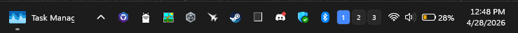
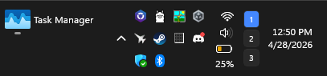
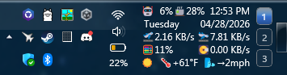
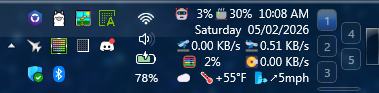

# Taskbar Virtual Desktop Switcher

A [Windhawk](https://windhawk.net) mod for Windows 11 that injects clickable buttons into the system tray — one per virtual desktop — for instant switching without opening Task View.

*Default size: three desktops in a row, desktop 1 active.*

*Taller taskbar: configurable grid layout with multiple rows.*

*Works alongside other mods (Task Manager Tail, weather widgets, etc.).*

*Five desktops in a compact 3×2 grid; the shorter second column is centered vertically.*

## Features

- Numbered, roman-numeral, dot, or custom-label buttons
- Smart grid layout with balanced, vertical-pack, horizontal-pack, and fixed override modes
- Highlights the active desktop immediately on switch
- Buttons appear/disappear as desktops are added or removed
- Five placement positions within the system tray
- Configurable size, spacing, colors, opacity, and shine effect
- Per-state text color, font size, corner radius, bold, and border
- Tooltip on each button shows the desktop's display name
- Option to hide the bar entirely when only one desktop exists

## Settings

| Setting | Default | Description |
|---------|---------|-------------|
| Position | After clock | Where in the system tray to inject |
| Button width | 20 px | Width of each button |
| Button height | 22 px | Height of each button |
| Button spacing | 2 px | Gap between buttons in the grid |
| Grid mode | Smart automatic | Smart, single row/column, fixed rows, fixed columns, or fixed grid |
| Smart layout | Balanced | Balanced, pack vertical, or pack horizontal |
| Fill order | Column-first | Column-first or row-first |
| Rows | 0 (auto) | Fixed rows, or max rows for smart mode when set |
| Columns | 0 (auto) | Fixed columns, or max columns for smart mode when set |
| Short group alignment | Center | Align a shorter last row/column to start, center, or end |
| Active color | `#4488FF` | Background for the current desktop |
| Inactive color | *(system)* | Background for other desktops |
| Opacity | 100 | 0–100; lower values let the taskbar show through |
| Shine effect | Off | Gradient highlight on buttons with custom colors |
| Label format | Numbers | Numbers · Roman numerals · Dots · Custom |
| Custom labels | *(empty)* | Comma-separated, e.g. `H,W,M` |
| Padding left | 0 px | Extra space to the left of the button grid |
| Padding right | 2 px | Extra space to the right of the button grid |
| Active text color | *(system)* | Foreground color for the current-desktop button |
| Inactive text color | *(system)* | Foreground color for other buttons |
| Font size | 10 pt | Button label size |
| Corner radius | 4 px | Rounded corners (0 = square, 4 = Windows default) |
| Active bold | Off | Bold the current desktop's label |
| Border thickness | 0 px | Button border width |
| Border color | *(system)* | Button border color |
| Hide when single | Off | Don't show the bar when only one desktop exists |
| Master button | Off | Optional Task View button for previewing, creating, or closing desktops |
| Master button position | After | Column before/after desktop buttons, or sliver row above/below |
| Master button sliver height | 6 px | Height of the master button when used as a sliver row |
| Master button column width | 14 px | Width of the master button when used as a side column |

## Known limitations

- Only the primary taskbar is supported (multi-monitor requires hooking secondary taskbars)
- Buttons may not appear until the mod injects on the first tray icon load; retry loop runs up to 5 times at 2-second intervals

## Credits and inspirations

This mod builds directly on patterns established by several community mods:

**[taskbar-empty-space-clicks](https://github.com/ramensoftware/windhawk-mods/blob/main/mods/taskbar-empty-space-clicks.wh.cpp)** — source of the `SwitchVirtualDesktop()` COM vtable pattern, build-specific IIDs for `IVirtualDesktopManagerInternal`, and the `IObjectArray` desktop enumeration approach.

**[taskbar-desktop-indicator](https://github.com/ramensoftware/windhawk-mods/blob/main/mods/taskbar-desktop-indicator.wh.cpp)** — reference for reading the current virtual desktop from the registry (session-scoped `VirtualDesktopIDs` + `CurrentVirtualDesktop` keys) and the notification cookie / `IVirtualDesktopNotificationService` registration pattern.

**[vertical-omnibutton](../vertical-omnibutton/vertical-omnibutton.wh.cpp)** (this lab, by sb4ssman) — source of the `GetTaskbarXamlRoot` boilerplate, `RunFromWindowThread` dispatcher, `FindCurrentProcessTaskbarWnd`, and the `IconView::IconView` hook-and-retry injection pattern.

**[windows-11-taskbar-styler](https://github.com/ramensoftware/windhawk-mods/blob/main/mods/windows-11-taskbar-styler.wh.cpp)** — reference for the `SystemTrayFrameGrid` XAML tree structure and element names (`ShowDesktopStack`, `NotificationCenterButton`, `ControlCenterButton`, `NotifyIconStack`).

**[Windhawk](https://windhawk.net)** by [m417z](https://github.com/m417z) — the modding platform that makes all of this possible.
